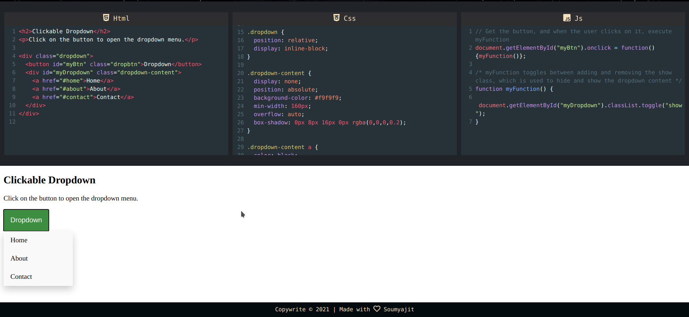

# Code Web Anywhere

 

## https://editor.soumyajit.tech/

 

  

### Online code editor for HTML, CSS and Javascript to discover frontend code

### Features:

- No installation work online and build sites
- Save of all your work
- Supports JQuery
- Autoclose of tags and brackets
